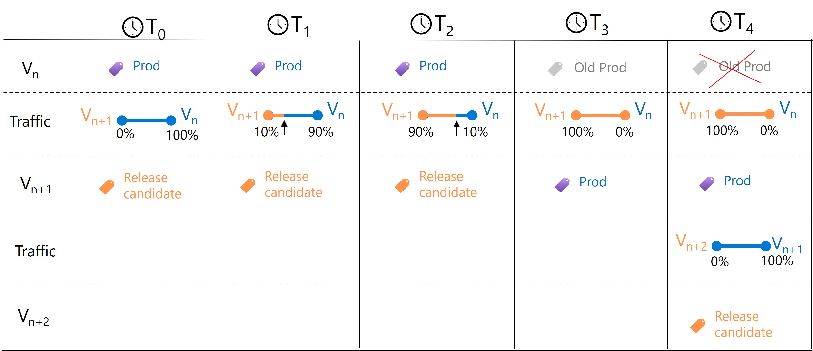

# Safe rollout of ML models using Azure ML Managed Online Endpoints

## User story
As an ML engineer, I want to use __devops pipelines__ to __safely rollout new version of a model__ in production __with validation gates__ inorder to __maintain production SLA__ and efficiently manage the rollout process

This repo shows how you can automate the rollout of a new version of a model into production without distruption.

## Semantics of safe rollout

The below illustration shows how users can gradually upgrade to version n+1 of the model from the currently running version n. At everystep it is a good practice to validate that operational metrics are all within threshold (e.g. response time tail latencies , #errors etc).

## Design of saferollout pipeline
In the example here you will see the flow from training -> model registration -> saferollout of new model version into production. You will see how we use [validate metrics](https://github.com/rsethur/validate-metrics) github action to automate the validation of operational metrics at very step of the rollout.

## Getting started
Just fork this repo and [follow instructions](docs/getting-started.md) to get started.

## References
1. [Validate metrics](https://github.com/rsethur/validate-metrics) github action
2. _[German Creditcard Dataset](https://www.kaggle.com/uciml/german-credit)_ from UCI/kaggle
 `Dua, D. and Graff, C. (2019). UCI Machine Learning Repository [http://archive.ics.uci.edu/ml]. Irvine, CA: University of California, School of Information and Computer Science.`